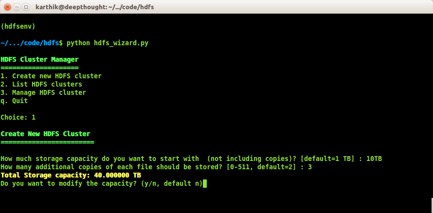
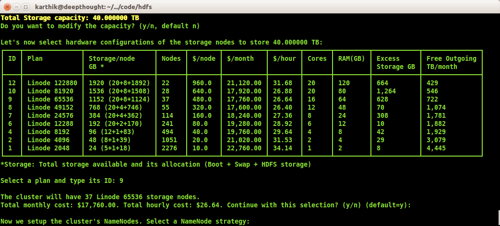
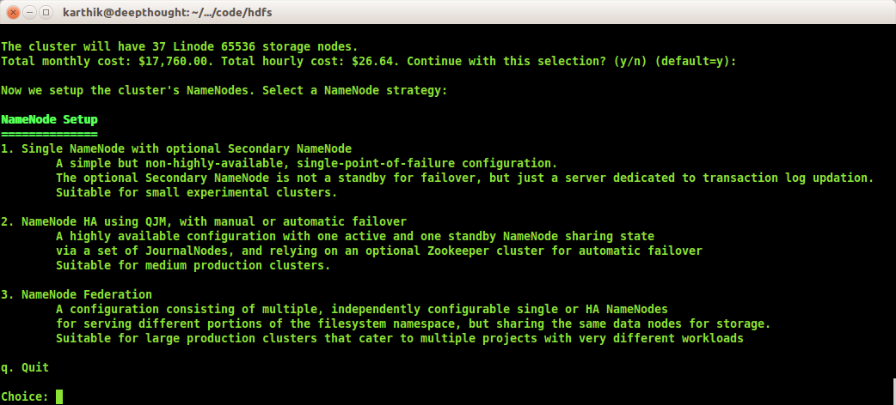
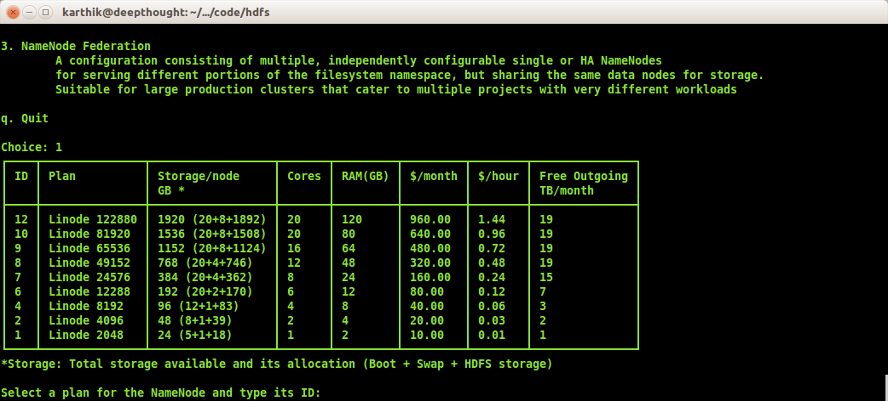
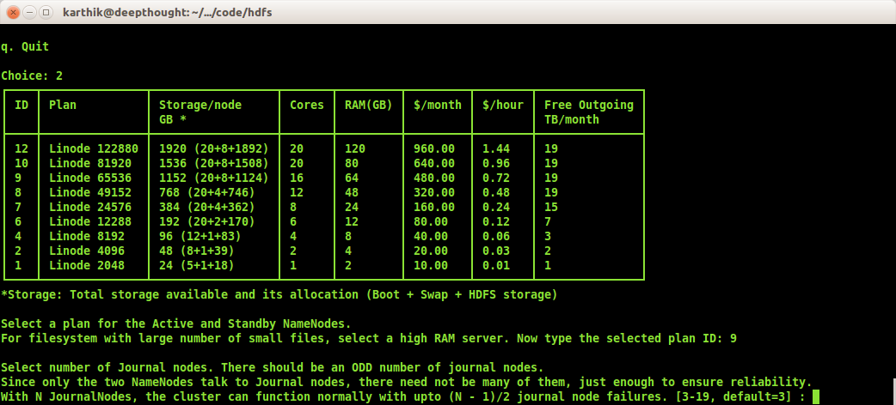

============================================================================

CAUTION:  

THIS IS STILL  A WORK IN PROGRESS AND IS NOT YET PRODUCTION READY.
FOLLOW THIS REPO TO BE NOTIFIED WHEN THERE'S A RELEASE VERSION.
THANK YOU FOR YOUR INTEREST!

============================================================================

# HDFS on Linode cloud

## What is this?

A console-based wizard to deploy HDFS clusters on the Linode cloud.
It can deploy

   - Simple HDFS clusters
   - HDFS HA (High Availability) clusters using Quorum Journal Manager and Zookeeper
   - HDFS Federation clusters
   
## What problems does it solve?

- HDFS is a complex system and requires in-depth understanding to deploy correctly. This wizard guides you with creating
  HDFS clusters and sizing them without having to read multiple docs and discussions.

- The wizard calculates monthly and hourly total cost of ownership at every step to help you with sizing decisions.
  
- The clusters created have secure-by-default configurations. Authentication, Authorization and Network security are
  configured by the wizard automatically.
  
## Screenshots  

**Launch wizard:**

**Storage Node Selection:**

**NameNode Setup:**

**NameNode Selection:**

**NameNode HA Configuration:**

## Installation

TODO

## Operations

TODO
